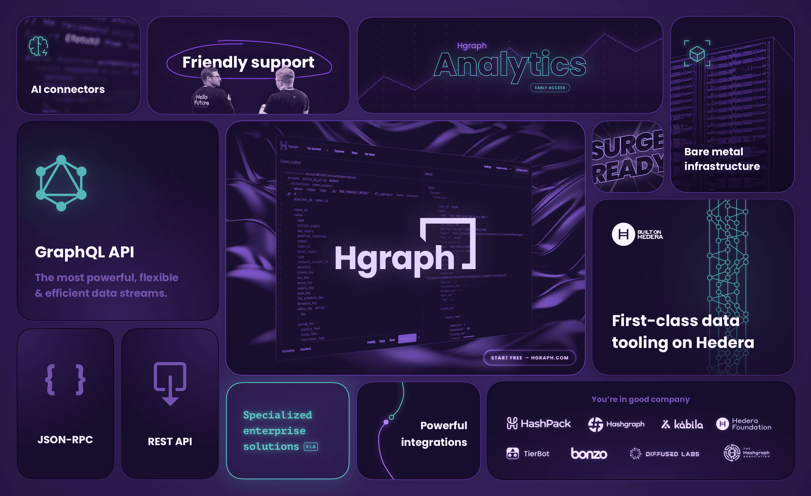

# Welcome to Hgraph 🙌

[Hgraph](https://hgraph.com) is a multi-chain infrastructure company. We provide APIs, indexed data, MCP servers for AI agents, and bare-metal infrastructure across Ethereum, Hedera, and beyond. We also partner with teams on custom engineering and consulting, smart contract development, cross-chain interoperability, and more.

## Get Started

- **[Hgraph App](https://app.hgraph.com)** — API playground, schema explorer, and usage monitoring. Get a free API key.
- **[Hgraph SDK](https://github.com/hgraph-io/sdk)** — Integrate our APIs with minimal setup.
- **[Documentation](https://docs.hgraph.com)** — Guides, references, and examples.
- **[Solutions](https://hgraph.com/solutions)** — Custom engineering and consulting.
- [View all repositories →](https://github.com/orgs/hgraph-io/repositories)

## Hgraph MCP & AI Tooling

Query live on-chain data using natural language through our MCP servers. Learn more at [hgraph.ai](https://hgraph.ai).

## Solutions

Beyond the self-serve platform, we work with teams on custom builds:

- **Smart contract development** — Solidity and EVM contracts, secure development, and audit coordination.
- **Cross-chain interoperability** — Bridges and messaging integrations built on LayerZero V2.
- **Custom data indexing** — Bespoke indexers, schemas, and GraphQL APIs for any chain.
- **Backend & infrastructure** — Bare-metal nodes, custom mirror nodes, observability, and production operations.
- **AI agent development** — Agents that query and surface onchain data via MCP.
- **Consulting & advisory** — Architecture reviews, technical due diligence, and embedded engineering.

[Learn more about our solutions →](https://hgraph.com/solutions)

## Ecosystem

- **[EtaFinance](https://eta.finance)** — Cross-chain bridge and DEX aggregator built on LayerZero, supporting Ethereum, Base, Polygon, Avalanche, and Hedera.
- **[hgraph.ai](https://hgraph.ai)** — AI agent tooling powered by our MCP servers and indexed data.
- **[Hedera Stats](https://hgraph.com/hedera/stats)** — Network analytics and dashboards.

## Featured Repositories

- **[sdk](https://github.com/hgraph-io/sdk)** — Hgraph SDK for working with our APIs.
- **[hedera-stats](https://github.com/hgraph-io/hedera-stats)** — Network analytics scripts and tooling.

## Community

- **[Newsletter](https://hgraph.beehiiv.com/subscribe)** — Subscribe via email.
- **[X (Twitter)](https://x.com/hgraph)** — Follow for updates.
- **[Discord](https://discord.gg/dwxpRHHVWX)** — Connect with our community and team.
- **[LinkedIn](https://www.linkedin.com/company/hgraph_io)** — Company news and partner highlights.

## Contact

Ready to build? [Get a free API key →](https://app.hgraph.com)

Want to work with us? [Get in touch →](https://hgraph.com/contact)
